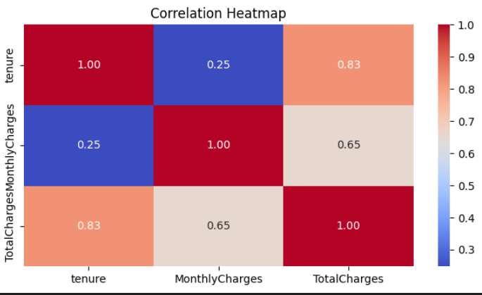

# 📉 Telco Customer Churn Prediction

## 📌 Overview
This project predicts customer churn for a telecom company using the **Telco Customer Churn dataset** (`WA_Fn-UseC_-Telco-Customer-Churn.csv`).  
It applies **Exploratory Data Analysis (EDA)**, **feature engineering**, and **machine learning models** to identify customers at risk of leaving.  
The goal is to provide insights that can help reduce churn and improve customer retention strategies.

## 🚀 Features
- **EDA** to understand customer demographics and service usage
- **Correlation heatmaps**, **count plots**, and **box plots** for visualization
- **Feature engineering**:
  - Tenure grouping
  - Total services count
- **Machine Learning models**:
  - Decision Tree
  - Random Forest
  - XGBoost
- **Model evaluation** using Accuracy and F1-score

## 🛠 Tech Stack
- **Languages**: Python  
- **Libraries**: Pandas, NumPy, Matplotlib, Seaborn, Scikit-learn, XGBoost  
- **Tools**: Jupyter Notebook, VS Code

## Key Insights
- Senior citizens, customers with shorter tenure, and those with higher monthly charges show higher churn rates.
- Customers subscribed to fewer services are more likely to leave.
- Electronic check payment method has higher churn correlation.

## Model Performance
| Model         | Accuracy | F1-Score |
| ------------- | -------- | -------- |
| Decision Tree | 76.5%    | 0.54     |
| Random Forest | 78.2%    | 0.56     |
| XGBoost       | 78.9%    | 0.57     |

## Correlation Heatmap

## Future Improvements
Use deep learning models for prediction

Deploy model as a web app using Flask or Streamlit

Implement real-time churn scoring pipeline

## Conclusion
This project demonstrates how EDA, feature engineering, and machine learning can help predict telecom customer churn.
By identifying at-risk customers early, businesses can take proactive steps to improve retention.
